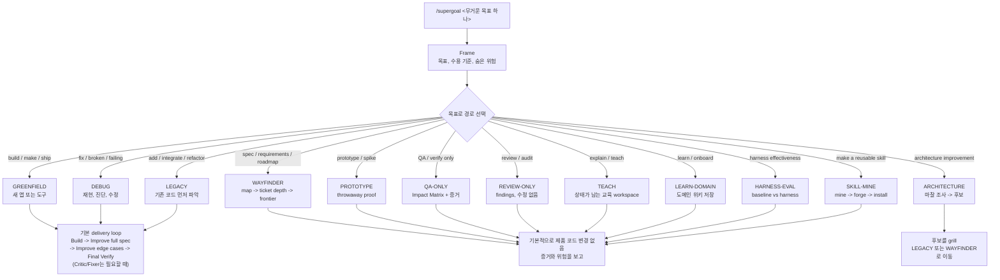

# /supergoal

[English](README.md) | **한국어**

**목표 하나를 주면, 가장 작은 올바른 변경을 만들고 실제 테스트로 확인합니다.**
새 도구를 따로 배울 필요는 없습니다. 저장소를 클론하고 스킬 디렉터리에 연결한 뒤 `/supergoal <목표>`.
랜딩 페이지: **[cskwork.github.io/supergoal-skill](https://cskwork.github.io/supergoal-skill/)**.

`/supergoal`은 단순히 "바로 수정"하기에는 놓칠 것이 많은 무거운 코딩 목표를 위한 스킬입니다. 목표 하나를
받아 알맞은 작업 경로를 고르고, 코드 delivery 작업에서는 새 컨텍스트 역할을 사용해 필요한 만큼만 고친 뒤,
요청/문서와 현재 동작을 다시 대조하고 실제 테스트로 확인한 다음 멈춥니다.

## `/supergoal`이 하는 일

`/supergoal`은 에이전트 실행에 붙는 라우팅과 검증 래퍼입니다. 쉽게 보면 이렇게 움직입니다.

1. **목표를 분류합니다.** 모드 표가 실제 작업 종류를 판단하고, 그다음 build, debug, legacy 변경,
   wayfinding, prototype, QA, review, architecture, teaching, domain onboarding, harness eval,
   skill mining 중 하나로 보냅니다.
   넓은 새 앱 build는 GREENFIELD에 남기되, 먼저 `wayfinder/` Frontier Map으로 한 개 세로 슬라이스만 delivery에 넣습니다.
2. **필요한 가이드만 읽습니다.** 루트 `SKILL.md`는 작게 유지하고, 각 경로가 필요한 `reference/`와
   `agents/` 파일만 로드합니다.
3. **역할마다 새 컨텍스트를 씁니다.** 무거운 작업은 Build, Improve full spec, Improve edge cases,
   Final Verify를 각각 새 컨텍스트의 역할로 나눕니다. 지휘 역할은 run vault와 필요한 파일만 넘기고,
   각 역할은 짧은 상태만 반환합니다. Critic/Fixer는 모든 작업의 기본이 아니라, 요구사항이 충분히
   드러나지 않은 작업에서만 쓰는 확장입니다.
4. **전/후 평가를 남깁니다.** 변경 전 상태와 변경 후 목표를 먼저 적고, 완료 약속과 재개 가능한
   `run-state.json`, 검증 명령 목록을 남겨서 "테스트 통과"라는 말로만 끝내지 않게 합니다.
5. **실제 프로젝트 기준으로 증명합니다.** 보이는 테스트가 통과해도 그대로 믿지 않고, 요청/티켓/README/
   설계/API 문서와 현재 동작을 다시 비교합니다. 실제 테스트, 브라우저 검증, 필요한 경우 DB 증거로 다시
   확인합니다. 숨은 요구사항은 증거로 남기고, Critic 확장을 쓸 때는 실패 테스트로 드러냅니다.
6. **검증된 결과에서 멈춥니다.** 끝없는 리팩터링, 자체 생성 체크리스트(proxy), 가짜 통과를 만들지 않습니다.

## 일반 실행보다 더해지는 것

강력한 모델이 실제 요구사항과 문서를 읽고 작업하는 것이 기준입니다. `/supergoal`은 일반 실행이 바쁜 작업 중에
건너뛰기 쉬운 부분만 보강합니다. Build 뒤에 현재 핵심 루프인 Improve full spec, Improve edge cases,
Final Verify를 거쳐 증거를 남깁니다. 요구사항이 덜 명시된 작업은 독립 검토자(Critic)가 요구사항 기반
실패 테스트를 쓰고 Fixer가 가장 작은 변경으로 통과시키는 방식으로 확장할 수 있습니다. 코드 delivery로
호출된 `/supergoal`은 인라인 단축 실행으로 낮추지 않고 role-loop를 사용합니다.

각 역할은 `agents/`에 파일로 들어 있습니다. 그래서 Claude Code, Codex, agy 같은 여러 에이전트 CLI에서 특정
harness에 묶이지 않고 역할을 나눠 실행할 수 있습니다. Build -> Improve full spec -> Improve edge cases ->
Final Verify가 필수 핵심이고, Critic/Fixer는 요구사항이 충분히 드러나지 않은 작업에서만 쓰는 확장입니다.
진행 에이전트는 가볍게 유지되고, 역할별 상세 가이드는 서브에이전트 안에서만 로드됩니다. 독립적인 작업
단위는 병렬로 돌립니다.

## 원칙

- **실제 기준으로 검증.** 프로젝트의 실제 테스트를 다시 돌리고, 테스트가 놓친 규칙은 사용자 요청, 티켓,
  README, 설계/API 문서, 저장소 규칙에서 다시 확인합니다. 자체 생성 체크리스트(proxy)나 검증기에 맞춰
  결과를 꾸미지 않습니다.
- **필요한 만큼만 변경.** 주변 코드 스타일을 따르고, 몇 줄 바꾸려고 파일 전체를 다시 쓰지 않습니다.
- **믿기 전에 강제 검증.** Build 뒤에 요청/문서와 현재 동작을 다시 비교합니다. 보이는 테스트가 통과해도
  그대로 완료로 보지 않습니다. Critic 확장은 숨은 요구사항 위험이 큰 작업에만 씁니다.
- **실제 코드 변경은 전/후 평가.** GREENFIELD는 없던 기능이나 실패 테스트를 변경 전 증거로 남기고,
  DEBUG는 증상을 먼저 재현하며, LEGACY/brownfield는 유지해야 할 기존 동작을 변경 전에 잡아둡니다.
- **진짜 모호할 때만 질문.** 코드로 답할 수 있는 내용은 먼저 코드를 읽어 해결합니다.
- **멈춰야 할 곳에서 멈춤.** 파괴적이거나 되돌릴 수 없는 작업은 동의를 구합니다. 실제 테스트가 통과하지
  못하면 그대로 보고하고, 통과한 것처럼 말하지 않습니다.
- **상시 규칙(먼저 읽음).** 대상 프로젝트에 `.supergoal/rules/RULES.md`가 있으면 supergoal은 매 실행 전에 읽고 모든
  모드에서 최우선 선호로 따릅니다 - 단 안전 게이트는 약화하지 않습니다. 요청할 때만 생성하며, gitignore되고
  그 외에는 그대로 둡니다(`reference/rules.md`).

## 모드

`/supergoal`은 목표 문장을 보고 작업 모드를 고릅니다:



| 목표 형태 | 모드 | 접근 |
|---|---|---|
| "새 앱/도구를 만든다/출시한다" | **GREENFIELD** | 기본 루프. 범위가 넓으면 먼저 `wayfinder/` Frontier Map을 만들고, 선택된 세로 슬라이스 하나만 Build로 넘김 |
| "고장/실패/크래시/왜 이러지" | **DEBUG** | 기본 루프; 실패 테스트부터 재현 |
| "기존/레거시 코드에 X를 추가한다" | **LEGACY** | 기본 루프; 코드 구조부터 파악 |
| "스펙 문서부터 구조화해줘 / 티켓으로 쪼개줘 / 로드맵 / 뭐부터 하지?" | **WAYFINDER** | 실행 vault의 `wayfinder/` 폴더에 지도를 만들고, 필요할 때만 티켓 안에 glossary, user story, EARS checks, design notes, tasks를 추가, 외부 사실 확인이 필요하면 `reference/research.md`로 인용된 research asset을 남김 -> 세로 슬라이스 티켓 -> blocker edge -> 다음 frontier; 티켓 하나만 delivery로 넘기고 멈춘 뒤 context clear + integration test를 요청 |
| "prototype / spike / variant를 먼저 보자" | **PROTOTYPE** | 질문 하나에 답하는 throwaway proof를 만들고, 삭제/격리하거나 결정만 delivery로 넘김 |
| "X를 설명/가르쳐줘" (코드 변경 없음) | **TEACH** | Mission -> Source -> Bridge -> Teach -> Check |
| "이 코드베이스를 학습/온보딩해줘" | **LEARN-DOMAIN** | Survey -> Map -> Ground -> `.domain-agent/` 위키 |
| "QA만/검증/데이터 비교" (코드 변경 없음) | **QA-ONLY** | 상세 Impact Matrix(기능 영향 범위 QA 지도) + 읽기 전용 DB -> 증거 -> `report.md` |
| "코드/diff/PR 리뷰만" (수정 없음) | **REVIEW-ONLY** | 독립 리뷰어 2명 -> 검증된 findings -> `report.md` |
| "구조 개선 / 리팩터링 후보 찾아줘" | **ARCHITECTURE** | 마찰 조사 -> 후보를 시각적 `report.html`로 제시 -> 고른 후보만 grill -> 리팩터링은 LEGACY/WAYFINDER로 |
| "harness 효과 테스트 / 유무 비교" | **HARNESS-EVAL** | 케이스 -> baseline -> harness -> 머신 체크 -> 품질 점수 -> 비교 |
| "히스토리에서 스킬 생성" (제품 코드 변경 없음) | **SKILL-MINE** | 히스토리 마이닝 -> 랭크 -> 선택 -> 포터블 `SKILL.md` 생성 -> 설치 |

**기본 루프(GREENFIELD / DEBUG / LEGACY)는 이렇게 움직입니다:**

1. **Frame**: `GOAL.md`를 가장 먼저 씁니다 - 사용자 요청 원문 인용 + 정제된 스펙 + 반증 가능한
   Success Criteria 체크박스(웹앱이면 브라우저 QA 케이스 포함). 이어서 그 파일만 읽고도 구현할 수 있는
   `PLAN.md`(단계, 사용할 도구/스킬, 검증 전략)를 동결하고, `QA.md` `## Before`와 `run-state.json`을
   시작합니다.
2. **계획 승인 게이트**: 대화형 세션에서는 `PLAN.md`를 보여주고 사용자의 명시적 OK를 받아야 구현이
   시작됩니다. 자율 실행(harness-eval, 백그라운드)은 auto-approved 사유를 `PLAN.md`에 기록하고
   진행합니다.
   범위가 넓은 GREENFIELD 요청은 이 단계에서 먼저 내부 `wayfinder/map.md`와 `wayfinder/tickets/`를 만들고,
   첫 번째 unblocked frontier 티켓의 acceptance check만 delivery `GOAL.md` / `PLAN.md`로 옮깁니다.
   사용자에게 보이는 route는 GREENFIELD로 유지합니다.
3. **Build**: 새 컨텍스트의 구현자가 `PLAN.md`만 읽고 가장 작은 올바른 변경을 만듭니다. 버그는 실패
   테스트로 먼저 재현합니다.
4. **Improve full spec**: 사용자 요청, 이슈/티켓, README, 설계/API 문서, `GOAL.md` Success Criteria를
   다시 읽습니다. 그 의도와 현재 코드 동작을 비교하고, 빠졌거나 틀린 동작만 가장 작게 고칩니다.
5. **Improve edge cases**: null/빈 값/경계값, 에러 경로, 상태/프로토콜, 호환성, 보안 부작용을 확인합니다.
6. **Final Verify**: 실제 테스트를 다시 돌리고, 구현자의 git diff를 `GOAL.md`와 대조해 충족된 기준을
   체크하고, 결과를 평이한 체크리스트 문장으로 `QA.md`에 남깁니다. 미충족 기준은 `R-LOOP.md`에
   타임스탬프 섹션으로 적고 구현자를 다시 띄웁니다.
7. **Critic -> Fixer(선택 확장)**: 요구사항이 덜 명시된 작업에서만 독립 검토자가 스펙 기반 실패 테스트를
   쓰고, Fixer가 가장 작은 변경으로 통과시킵니다.
8. **완료**: `GOAL.md`의 모든 체크박스가 채워졌을 때만 작업 브랜치와 완료 시각을 담은 `Z-<날짜>.md`를
   만들고 멈춥니다. 어떤 명령으로 검증했는지 함께 보고합니다. 핵심 루프는 기본 8회 상한을 두고, 상한에
   닿으면 무엇이 막히는지 먼저 반성 기록을 남깁니다.

```text
/supergoal 습관 추적 앱을 만들어서 출시해줘
/supergoal 결제 페이지가 프로덕션에서 간헐적으로 멈춰. 고쳐줘
/supergoal 레거시 Django 모놀리스에 SSO를 추가해줘
/supergoal 결제 마이그레이션을 blocker 포함 티켓으로 쪼개고 뭐부터 할지 알려줘
/supergoal 구현 전에 체크아웃 플로우 3개를 prototype으로 비교해줘
/supergoal 이 코드베이스를 학습하고 도메인 위키를 만들어줘
/supergoal 스테이징 결제 플로우를 QA하고 주문 합계가 DB와 맞는지 확인해줘 (코드 변경 없음)
/supergoal 이 마이그레이션 harness를 3개 케이스에서 유무 비교해줘
```

WAYFINDER, PROTOTYPE, QA-ONLY, REVIEW-ONLY, ARCHITECTURE, TEACH/LEARN-DOMAIN, HARNESS-EVAL, SKILL-MINE은
각각 목적이 다른 유틸리티입니다. 티켓 지도, 버릴 수 있는 proof, 코드 변경 없는 QA, 수정 없는 리뷰,
교육/온보딩, harness 측정, 스킬 생성처럼 제품 코드를 바로 고치지 않는 작업을 다룹니다. QA-ONLY는 넓은
회귀 검증 경로입니다. Impact Matrix는 기능이 영향을 줄 수 있는 화면, 데이터 경로, 권한,
전/중/후 액션, 실패 케이스를 펼친 QA 지도입니다. 직접 동작, 인접 화면, 표시 데이터 일관성,
복잡한 다단계 시나리오, 실행하지 못한 위험을 정해진 범위 안에서 기록합니다. 독립적인 QA 영역은
시나리오 단위로 나눠 병렬 실행하고, 진행 에이전트가 `qa/scenario-ledger.md`에 병합합니다.
기본적으로 제품 코드는 쓰지 않습니다. PROTOTYPE은 격리된 throwaway 코드만 쓰고, 실제로 ship하려면 다시
delivery 경로를 통과해야 합니다.

## Board (선택형 실시간 대시보드)

동시에 실행되는 에이전트의 진행 상황을 실시간으로 볼 수 있습니다. `bash tui/launch.sh &`는 브라우저에서 보는
Textual 기반 대시보드를 열고, 각 에이전트의 모드와 단계(Frame -> Build -> Improve -> Final Verify,
필요하면 Critic/Fixer)를 repo / branch / worktree별 작업 보드로 보여줍니다. 브랜치는 참고 정보일 뿐 잠금이
아니므로 여러 에이전트가 같은 브랜치를 공유할 수 있습니다.

Board는 관찰 전용입니다. 켜지 않아도 모든 모드는 그대로 동작하고, 켜져 있어도 실행을 막거나 통과시키지
않습니다. 활성화하면 진행 에이전트가 단계 전환마다 `sg-emit`(`templates/observability/`)을 호출해
`~/.supergoal/runs/agents/` 아래 상태 JSON을 안전하게 교체합니다. 대시보드(`tui/`)는 그 파일을 주기적으로
읽어 화면에 보여줍니다. 브라우저 실행에는 `pip install textual-serve`가 필요하고, 없으면
`python -m tui.app`으로 로컬 TUI를 실행합니다. 상세 스펙은
[`reference/observability.md`](reference/observability.md)를 참고하세요.

## 설치

이 저장소가 곧 스킬입니다. 사용하는 에이전트 CLI가 스킬을 찾는 위치에 연결하세요:

```bash
git clone https://github.com/cskwork/supergoal-skill.git
cd supergoal-skill
SRC="$(pwd)"
mkdir -p ~/.agents/skills ~/.codex/skills ~/.claude/skills

# 권장: 하나의 canonical source checkout을 각 에이전트에 심링크합니다.
# 기존 대상이 있으면 먼저 audit하고 로컬 수정은 보존한 뒤 교체하세요.
ln -s "$SRC" ~/.agents/skills/supergoal
ln -s "$SRC" ~/.codex/skills/supergoal
ln -s "$SRC" ~/.claude/skills/supergoal

# 설치본이 소스와 달라졌는지 확인:
node templates/skill-install-audit.mjs "$SRC"

# 저장소 검증:
bash tests/run-all.sh
```

이후 사용하는 에이전트 CLI에서 `/supergoal <목표>`를 실행하면 됩니다.

### Windows

스킬 자체는 Windows에서 동작합니다. 다만 남아 있는 gate/test 스크립트는 POSIX 셸 기준이므로 **Git Bash**
또는 **WSL**에서 실행하세요(`node`가 `PATH`에 있어야 합니다). 저장소는 `.gitattributes eol=lf`로 줄바꿈을
고정합니다. 심링크에 관리자 권한이 필요하면 **복사**로 설치하세요(Git Bash/WSL의 `cp -R`, 또는 관리자
`cmd`의 `mklink /D`). 복사 후에는 `node templates/skill-install-audit.mjs <source-skill-dir>`를
실행하고, 컨트랙트 테스트는 **WSL** bash에서 실행하세요.

## 레이아웃

```
SKILL.md            핵심 안내: baseline-first 루프, 모드, 레퍼런스 맵
agents/             역할별 지침 파일 (analyst, architect, executor, debugger, explore, designer, qa-*, db-reader, code-reviewer, security-reviewer)
reference/          상황별 상세 가이드: domain-rules · rules(프로젝트 상시 규칙) · domain-context · debugging · interview · delivery-gate · plan-grounding · research · market-research · qa · qa-only · db-access · teach · learn-domain · ui-ux · taste-skill-v2 · functional-ui · harness-eval · skill-mine
teach/              TEACH 모드 형식 가이드와 주제별 교육 워크스페이스
templates/          검증 스크립트와 템플릿: GOAL.md · PLAN.md · QA.md · R-LOOP.md · Z-DONE.md · run-state.json · rules.md · qa-gate.sh · qa-only-gate.sh · commit-gate.sh · contrast-gate.mjs · learn-grounding-gate.mjs · qa-report.md · db-access/ · domain-agent/ · domain-onboarding.html · arch-report.html · harness-eval-gate.mjs · harness-eval-stats.mjs · harness-eval-cases/ · skill-mine/ · skill-frontmatter-gate.mjs · skill-install-audit.mjs · skill.md.template · observability/ (sg-emit board state)
tests/              contract tests + run-all.sh canonical verifier
tui/                선택형 실시간 Board: state.py(reader) · app.py(Textual UI) · serve.py(브라우저) · launch.sh
docs/               설계 문서, 연구 메모, experiments/, changelog/, 랜딩 페이지(index.html)
examples/           vendored된 경우에만 있는 선택 예제; 없으면 run-all이 건너뜀
```

## 근거

설계는 같은 과제를 baseline과 harness로 비교한 head-to-head eval에 기반합니다. 특히
`docs/experiments/2026-07-01-roleloop-coverage-fix-claude-ab/FINDINGS.md`와
`docs/harness-eval-explained.md`를 참고하세요. 현재 스킬에 반영된 결론은 단순합니다. 명시 스펙이 있는
과제에서는 요청/문서 확인 패스가 한 번에 처리하는 baseline을 이겼고, 항상 켜진 역할 분담보다 더 단순한 핵심
장치였습니다. 자체 생성 검증기(proxy)에 맞춰 점수를 맞추면 Goodhart 현상으로 오히려 품질이 낮아질 수
있습니다. 다음 증거 범위는 합성 fixture가 아니라
`docs/changelog/2026-07/02-production-adoption/plan.md`의 프로덕션 채택 계획입니다. 여기서는 심링크
배포, 실제 문구 트리거 정확도, 프로덕션 파일럿의 날짜·모드·격차·게이트 결과를 추적합니다.
과거 예제는 `examples/` 아래에 vendored될 수 있고, 없으면 canonical verifier가 그 선택 단계를 건너뜁니다.

## Harness Eval 레퍼런스

HARNESS-EVAL에서 재사용하는 샘플 케이스는 RevFactory의 `claude-code-harness`에서 가져왔습니다:
https://github.com/revfactory/claude-code-harness/

현재 HARNESS-EVAL 주장은 네 축을 함께 봅니다: 작업 정확도, 토큰/비용, 실행 시간, 라우팅 정확도.
이진 pass/fail 비교는 SNR 필터를 거친 paired McNemar를 쓰고, 점수형 품질 비교는 기존 sign-flip/BCa
게이트를 유지합니다.

## 크레딧

컨셉과 워크플로는 cskwork의 **oh-my-symphony**에서 차용했습니다
(https://github.com/cskwork/oh-my-symphony). WAYFINDER와 research-depth 아이디어는 Matt Pocock의
공개 스킬, 특히 research와 skill-writing 패턴에서도 많은 개념을 가져왔습니다.
여러 에이전트 CLI에서 쓸 수 있게 구성했습니다.

## 라이선스

MIT. [`LICENSE`](LICENSE) 참고.
