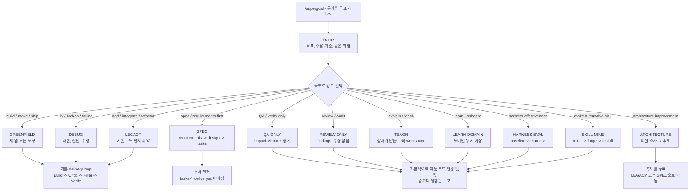

# /supergoal

[English](README.md) | **한국어**

**목표 하나를 주면, 가장 작은 올바른 변경을 만들고 실제 테스트로 확인합니다.**
새 도구를 따로 배울 필요는 없습니다. 저장소를 클론하고 스킬 디렉터리에 연결한 뒤 `/supergoal <목표>`.
랜딩 페이지: **[cskwork.github.io/supergoal-skill](https://cskwork.github.io/supergoal-skill/)**.

`/supergoal`은 단순히 "바로 수정"하기에는 놓칠 것이 많은 무거운 코딩 목표를 위한 스킬입니다. 목표 하나를
받아 알맞은 작업 경로를 고르고, 프롬프트에 빠진 요구사항을 먼저 찾아내고, 필요한 만큼만 고친 뒤,
프로젝트의 실제 테스트와 스펙으로 맞는지 확인하고 멈춥니다.

## `/supergoal`이 하는 일

`/supergoal`은 agent 위에 얹는 라우팅과 검증 래퍼입니다. 쉽게 보면 이렇게 움직입니다:

1. **목표를 분류합니다.** 요청을 build, debug, legacy 변경, spec, QA, review, architecture, teaching,
   domain onboarding, harness eval, skill mining 중 하나로 고릅니다.
2. **필요한 playbook만 읽습니다.** 루트 `SKILL.md`는 작게 유지하고, 각 경로가 필요한 `reference/`와
   `agents/` 파일만 로드합니다.
3. **역할을 분리합니다.** 무거운 작업은 build, critic, fixer, verifier를 신선한 컨텍스트의
   서브에이전트로 나눠서, 같은 컨텍스트가 답을 만들고 스스로 채점하지 않게 합니다.
4. **전/후 평가를 남깁니다.** 변경 전 상태와 변경 후 목표를 먼저 적고, 어떤 명령으로 그 차이를
   증명했는지 남겨서 단순히 "테스트 통과"라고 말하지 않게 합니다.
5. **실제 프로젝트 기준으로 증명합니다.** 숨은 요구사항은 실패 테스트나 증거로 드러내고, 실제 테스트,
   브라우저 검증, 필요한 경우 DB 증거, prose 스펙으로 다시 확인합니다.
6. **검증된 결과에서 멈춥니다.** 끝없는 리팩터링, proxy 체크리스트, 가짜 green을 만들지 않습니다.

## 일반 실행보다 더해지는 것

강한 모델이 실제 스펙을 읽고 작업하는 것이 기준입니다. `/supergoal`은 여기에 한 가지를 더합니다:
사용자가 말하지 않았지만 스펙상 반드시 지켜야 하는 요구사항을 독립 검토자(Critic)가 실패하는 테스트로
먼저 드러냅니다. 그다음 가장 작은 변경으로 통과시키고, 생성된 proxy가 아니라 프로젝트의 실제 테스트와
스펙으로 다시 확인합니다. 단순 문구 수정처럼 아주 작은 작업이면 스킬 없이 바로 고치는 편이 낫습니다.

각 역할은 `agents/`에 파일로 들어 있습니다. 그래서 Claude Code, Codex, agy 같은 여러 agent CLI에서 특정
harness에 묶이지 않고 dispatch할 수 있습니다. 각 역할은 기본적으로 신선한 컨텍스트의 서브에이전트로 실행됩니다.
conductor는 가볍게 유지되고 역할의 무거운 reference는 서브에이전트 안에서 로드되며, 독립적인 작업 단위는 병렬로
돌립니다. trivial한 단일 편집만 inline으로 처리합니다.

## 원칙

- **실제 기준으로 검증.** 프로젝트의 실제 테스트를 다시 돌리고, 테스트가 놓친 규칙은 prose 스펙을 다시
  읽습니다. 생성된 proxy 체크리스트나 verifier에 맞춰 결과를 꾸미지 않습니다.
- **필요한 만큼만 변경.** 주변 코드 스타일을 따르고, 몇 줄 바꾸려고 파일 전체를 다시 쓰지 않습니다.
- **숨은 요구사항을 먼저 드러냄.** 프로세스가 일반 실행보다 나아지는 핵심 지점입니다.
- **실제 코드 변경은 전/후 평가.** GREENFIELD는 없던 기능이나 실패 테스트를 변경 전 증거로 남기고,
  DEBUG는 증상을 먼저 재현하며, LEGACY/brownfield는 유지해야 할 기존 동작을 변경 전에 잡아둡니다.
- **진짜 모호할 때만 질문.** 코드로 답할 수 있는 내용은 먼저 코드를 읽어 해결합니다.
- **멈춰야 할 곳에서 멈춤.** 파괴적이거나 되돌릴 수 없는 작업은 동의를 구합니다. 실제 테스트가 통과하지
  못하면 그대로 보고하고, 통과한 것처럼 말하지 않습니다.
- **상시 규칙(먼저 읽음).** 대상 프로젝트에 `.supergoal/rules/RULES.md`가 있으면 supergoal은 매 실행 전에 읽고 모든
  모드에서 최우선 선호로 따릅니다 - 단 안전 게이트는 약화하지 않습니다. 요청할 때만 생성하며, gitignore되고
  그 외에는 그대로 둡니다(`reference/rules.md`).

## 모드

`/supergoal`은 목표 문장을 보고 작업 모드를 고릅니다:



| 목표 형태 | 모드 | 접근 |
|---|---|---|
| "새 앱/도구를 만든다/출시한다" | **GREENFIELD** | 기본 루프 |
| "고장/실패/크래시/왜 이러지" | **DEBUG** | 기본 루프; 실패 테스트부터 재현 |
| "기존/레거시 코드에 X를 추가한다" | **LEGACY** | 기본 루프; 코드 구조부터 파악 |
| "스펙 문서부터 구조화해줘" | **SPEC** | 핵심 결정은 한 번에 한 질문씩 grill -> requirements/design/tasks가 `docs/spec/`에 굳어짐 -> 그 문서가 기본 루프를 이끎 |
| "X를 설명/가르쳐줘" (코드 변경 없음) | **TEACH** | Mission -> Source -> Bridge -> Teach -> Check |
| "이 코드베이스를 학습/온보딩해줘" | **LEARN-DOMAIN** | Survey -> Map -> Ground -> `.domain-agent/` 위키 |
| "QA만/검증/데이터 비교" (코드 변경 없음) | **QA-ONLY** | 상세 Impact Matrix(기능 영향 범위 QA 지도) + 읽기 전용 DB -> 증거 -> `report.md` |
| "코드/diff/PR 리뷰만" (수정 없음) | **REVIEW-ONLY** | 독립 리뷰어 2명 -> 검증된 findings -> `report.md` |
| "구조 개선 / 리팩터링 후보 찾아줘" | **ARCHITECTURE** | 마찰 조사 -> 후보를 시각적 `report.html`로 -> 고른 후보 grill -> 리팩터링은 LEGACY/SPEC으로 |
| "harness 효과 테스트 / 유무 비교" | **HARNESS-EVAL** | 케이스 -> baseline -> harness -> 머신 체크 -> 품질 점수 -> 비교 |
| "히스토리에서 스킬 생성" (제품 코드 변경 없음) | **SKILL-MINE** | 히스토리 마이닝 -> 랭크 -> 선택 -> 포터블 `SKILL.md` 생성 -> 설치 |

**기본 루프(GREENFIELD / DEBUG / LEGACY)는 이렇게 움직입니다:**

1. **Frame**: 목표와 수용 기준을 한 줄로 정리합니다.
2. **Before/After Eval**: 변경 전 상태, 변경 후 목표, 검증 명령을 `delivery-proof.md`에 남깁니다.
3. **Build**: 가장 작은 올바른 변경을 만듭니다. 버그는 실패 테스트로 먼저 재현합니다.
4. **Critic**: 독립 검토자가 스펙을 다시 읽고, 기존 테스트가 놓친 필수 동작마다 실패하는 테스트를 씁니다.
5. **Fixer**: 가장 작은 변경으로 그 테스트들을 통과시킵니다.
6. **Verify**: 실제 테스트로 다시 확인하고, 테스트가 덮지 못한 규칙은 스펙을 다시 읽습니다. 변경 후 증거,
   결정 게이트, 남은 위험까지 기록한 뒤 멈추고, 어떤 명령으로 검증했는지 함께 보고합니다.

```text
/supergoal 습관 추적 앱을 만들어서 출시해줘
/supergoal 결제 페이지가 프로덕션에서 간헐적으로 멈춰. 고쳐줘
/supergoal 레거시 Django 모놀리스에 SSO를 추가해줘
/supergoal 이 코드베이스를 학습하고 도메인 위키를 만들어줘
/supergoal 스테이징 결제 플로우를 QA하고 주문 합계가 DB와 맞는지 확인해줘 (코드 변경 없음)
/supergoal 이 마이그레이션 harness를 3개 케이스에서 유무 비교해줘
```

QA-ONLY, REVIEW-ONLY, ARCHITECTURE, TEACH/LEARN-DOMAIN, HARNESS-EVAL, SKILL-MINE은 각각 다른 목적의 유틸리티입니다.
상세 코드 없는 QA, 수정 없는 리뷰, 교육/온보딩, harness 측정, 스킬 생성처럼 제품 코드를 바로 고치지 않는
작업을 다룹니다. QA-ONLY는 넓은 회귀 검증 lane입니다. Impact Matrix는 기능이 영향을 줄 수 있는 화면,
데이터 경로, 권한, 전/중/후 액션, 실패 케이스를 펼친 QA 지도입니다. 직접 동작, 인접 화면, 표시 데이터
일관성, 복잡한 다단계 시나리오, 실행하지 못한 위험을 action cap 안에서 기록합니다. 독립적인 QA 영역은
scenario shard로 나눠 병렬 실행하고, conductor가 `qa/scenario-ledger.md`에 병합합니다. 기본적으로 제품 코드는
쓰지 않고, 무언가 설치하기 전에는 사용자에게 먼저 확인합니다.

## 설치

이 저장소가 곧 스킬입니다. 사용하는 agent CLI가 스킬을 찾는 위치에 연결하세요:

```bash
git clone https://github.com/cskwork/supergoal-skill.git
# 사용하는 에이전트의 스킬 디렉터리에 심링크하거나 복사:
ln -s "$(pwd)/supergoal-skill" <your-agent-skills-dir>/supergoal
# 예: ~/.claude/skills/supergoal, ~/.codex/skills/supergoal, ~/.agents/skills/supergoal
```

이후 사용하는 agent CLI에서 `/supergoal <목표>`를 실행하면 됩니다.

### Windows

스킬 자체는 Windows에서 동작합니다. 다만 남아 있는 gate/test 스크립트는 POSIX 셸 기준이므로 **Git Bash**
또는 **WSL**에서 실행하세요(`node`가 `PATH`에 있어야 합니다). 저장소는 `.gitattributes eol=lf`로 줄바꿈을
고정합니다. 심링크에 관리자 권한이 필요하면 **복사**로 설치하세요(Git Bash/WSL의 `cp -R`, 또는 관리자
`cmd`의 `mklink /D`). 컨트랙트 테스트는 **WSL** bash에서 실행하세요.

## 레이아웃

```
SKILL.md            핵심 안내: baseline-first 루프, 모드, 레퍼런스 맵
agents/             역할별 지침 파일 (analyst, architect, executor, debugger, explore, designer, qa-*, db-reader, code-reviewer, security-reviewer)
reference/          상황별 상세 가이드: domain-rules · rules(프로젝트 상시 규칙) · domain-context · debugging · interview · delivery-gate · plan-grounding · market-research · qa · qa-only · db-access · teach · learn-domain · ui-ux · taste-skill-v2 · functional-ui · harness-eval · skill-mine
teach/              TEACH 모드 형식 가이드와 주제별 교육 워크스페이스
templates/          검증 스크립트와 템플릿: delivery-proof.md · rules.md · qa-gate.sh · qa-only-gate.sh · commit-gate.sh · contrast-gate.mjs · learn-grounding-gate.mjs · qa-report.md · domain-agent/ · domain-onboarding.html · arch-report.html · harness-eval-gate.mjs · harness-eval-cases/ · skill-mine/ · skill-frontmatter-gate.mjs · skill.md.template
docs/               설계 문서, 연구 메모, experiments/, changelog/, 랜딩 페이지(index.html)
examples/url-shortener/   build / debug / extend 모드로 다룬 예제 서비스
```

## 근거

설계는 같은 과제를 baseline과 harness로 비교한 head-to-head eval에 기반합니다:
`docs/experiments/2026-06-07-harness-eval-*`와 `log/changelog-2026-06-07.md`(3 케이스, 2 모델, 4 harness
형태)를 참고하세요. 핵심 결론은 단순합니다. 명시 스펙이 있는 과제에서는 실제 스펙을 읽는 강한 baseline이
기준이며, 생성된 proxy verifier에 맞춰 점수를 맞추면 Goodhart 현상으로 오히려 품질이 낮아질 수 있습니다.
`examples/url-shortener/`는 build·debug·extend 모드로 다룬 예제 서비스입니다.

## Harness Eval 레퍼런스

HARNESS-EVAL에서 재사용하는 샘플 케이스는 RevFactory의 `claude-code-harness`에서 가져왔습니다:
https://github.com/revfactory/claude-code-harness/

## 크레딧

컨셉과 워크플로는 cskwork의 **oh-my-symphony**에서 차용했습니다
(https://github.com/cskwork/oh-my-symphony). 여러 agent CLI에서 쓸 수 있게 구성했습니다.

## 라이선스

MIT. [`LICENSE`](LICENSE) 참고.
