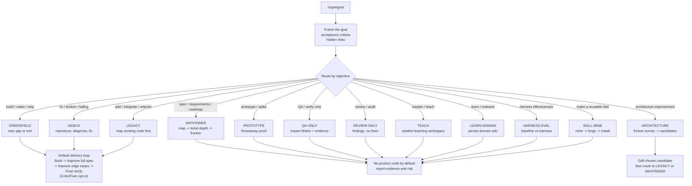

# /supergoal

**English** | [한국어](README.ko.md)

**One objective in, a verified result out - the smallest correct change, checked against the real tests.**
No extra install: clone the repo, symlink it into your skills directory, then `/supergoal <objective>`.
Landing page: **[cskwork.github.io/supergoal-skill](https://cskwork.github.io/supergoal-skill/)**.

An agent skill for heavy coding objectives where a normal "just edit it" pass is too easy to fool. It
takes one objective, chooses the right workflow route, uses fresh-context roles for code delivery, makes
the smallest correct change, checks the request and project docs against the real behavior, then stops.

## What `/supergoal` does

`/supergoal` is a routing and verification wrapper around an agent. The useful mental model:

1. **Route the objective.** The mode table classifies the real work kind, then routes as build,
   debug, legacy change, spec, wayfinding, prototype, QA, review, architecture, teaching, domain
   onboarding, harness eval, or skill mining.
   Broad new-app builds stay GREENFIELD but first get a `wayfinder/` Frontier Map so only one vertical slice enters delivery.
2. **Load only the needed playbook.** The root `SKILL.md` stays small; each route loads its own
   `reference/` and `agents/` files only when needed.
3. **Keep contexts fresh.** Code delivery runs Build, Improve full spec, Improve edge cases, and
   Final Verify as separate fresh-context roles. The conductor passes the run vault and needed files,
   then collects short status. Critic/Fixer is an opt-in escalation for under-specified work, not the
   always-on default.
4. **Run Before/After Eval.** Capture the before state, define the after target, write a completion
   promise, and keep a resumable run state plus command manifest so the final claim proves the delta
   instead of just saying "tests passed."
5. **Prove against the real project.** Visible-green is not trusted by itself; the run re-reads the whole
   spec and verifies with the repo's real tests, browser checks, DB evidence when load-bearing, and prose
   spec. Hidden requirements become durable evidence, and failing tests when the critic escalation is used.
6. **Stop at the verified result.** No open-ended refactor, no proxy checklist, no fake green.

## What it adds over a plain baseline

A strong model with the real spec is the bar. `/supergoal` adds the part a plain baseline skips under
pressure: after Build, it runs the current core loop - Improve full spec, Improve edge cases, then Final
Verify - and records the proof. For genuinely under-specified work, it can escalate to an independent
critic that writes spec-derived failing tests before a fixer clears them. Once invoked for code delivery,
`/supergoal` uses the role-loop instead of downgrading to an inline shortcut.

Each role is a bundled file in `agents/`, so dispatch stays harness-agnostic across Claude Code, Codex,
agy, and other agent CLIs. Build -> Improve full spec -> Improve edge cases -> Final Verify is the
mandatory core; Critic/Fixer stays available for the under-specified frontier. The conductor stays lean:
subagents load the heavy references for their phase, and independent units run in parallel.

## Principles

- **Verify against ground truth.** Re-run the project's REAL tests and re-read the request, ticket,
  README, design/API docs, and repo rules for checks the tests miss. Never generate a proxy
  checklist/verifier and optimize to it.
- **Smallest correct change.** Match the surrounding code; no whole-file rewrites to change a few lines.
- **Forced verification before trust.** After Build, compare the request/docs with the current behavior,
  even when visible tests are green; critic escalation is reserved for latent requirement risk.
- **Before/After Eval for real code changes.** GREENFIELD proves what was absent or red before; DEBUG
  reproduces the symptom; LEGACY/brownfield captures behavior to preserve before changing it.
- **Ask only when genuinely ambiguous.** Resolve code-answerable questions by reading the code.
- **Hard stops.** A destructive/irreversible step needs consent; if the real tests cannot pass, report it -
  never fake a pass.
- **Standing rules (read first).** If the target project has `.supergoal/rules/RULES.md`, supergoal reads it before
  every run and honors it across all modes as the highest-priority preferences - never weakening safety
  gates. Created only when you ask, gitignored, and otherwise left untouched (`reference/rules.md`).

## Modes

`/supergoal` detects the mode from your objective:



| Objective looks like | Mode | Approach |
|---|---|---|
| "build / ship a new app/tool" | **GREENFIELD** | default loop; broad/foggy app requests first use a `wayfinder/` Frontier Map, then one selected vertical slice enters Build |
| "fix / broken / failing / why does" | **DEBUG** | default loop; reproduce with a failing test first |
| "add X to our existing/legacy code" | **LEGACY** | default loop; map the code first; refactoring an existing API: capture its exact behavior first, Verify diffs against that baseline |
| "spec this / break this into tickets / roadmap / what first?" | **WAYFINDER** | issue map under the run vault's `wayfinder/` folder -> optional ticket-depth sections (glossary, user story, EARS checks, design notes, tasks) and cited research assets via `reference/research.md` when outside facts are needed -> vertical tickets -> blocker edges -> next frontier; route one ticket, stop, then ask for context clear + integration test before the next |
| "prototype / spike / try variants before building" | **PROTOTYPE** | throwaway proof answers one question; then delete/quarantine or route the decision into delivery |
| "explain / teach me X" (no code) | **TEACH** | Mission -> Source -> Bridge -> Teach -> Check (explain-back) |
| "learn / map / onboard onto this codebase" | **LEARN-DOMAIN** | Survey -> Map -> Ground -> Persist a `.domain-agent/` wiki |
| "QA only / verify / compare data - no code" | **QA-ONLY** | Detailed Impact Matrix (feature-impact QA map) + read-only DB -> evidence -> `report.md` |
| "review / audit this code/diff/PR - no fixes" | **REVIEW-ONLY** | Two independent reviewers -> verified findings -> `report.md` |
| "improve the architecture / find refactoring opportunities" | **ARCHITECTURE** | Friction survey -> candidates as a visual `report.html` -> grill the pick -> refactor routes to LEGACY/WAYFINDER |
| "test harness effectiveness / with vs without" | **HARNESS-EVAL** | Cases -> baseline run -> harness run -> machine checks -> quality score -> compare |
| "make a skill from history - no product code" | **SKILL-MINE** | Mine history -> rank -> you pick -> forge portable `SKILL.md` -> install |

**Default loop (GREENFIELD / DEBUG / LEGACY):** 1) **Frame** the goal: write `GOAL.md` first (the user's
request verbatim + refined spec + falsifiable Success Criteria checkboxes + browser QA cases for web
apps), freeze a self-sufficient `PLAN.md` (steps, tools & skills, verification strategy), start `QA.md`
`## Before` plus `run-state.json`, then clear the plan approval gate (interactive: the user's explicit
OK; autonomous: auto-approved, recorded). For broad GREENFIELD requests, Frame first writes an internal
`wayfinder/map.md`, creates vertical tickets
under `wayfinder/tickets/`, selects the first unblocked frontier, and copies only that ticket's
acceptance checks into delivery. The route remains GREENFIELD; WAYFINDER stays the explicit no-code
planning mode. 2) **Build** the smallest correct change in a fresh-context
implementer briefed by `PLAN.md` alone, test-first (bug -> failing test first); 3) **Improve full spec**
by re-reading the user's request, issue/ticket, README, design/API docs, and `GOAL.md` Success Criteria,
then fixing the smallest
gap between that intent and the current behavior; 4) **Improve edge cases** by checking degenerate
inputs, edge/error paths, state/protocol, compatibility, and security side effects; 5) **Final Verify**
by re-running the real tests, diffing the implementer's changes against `GOAL.md`, ticking each criterion
proven met, and recording plain checklist results in `QA.md`; unmet criteria go to a timestamped
`R-LOOP.md` section and the implementer relaunches; 6) escalate to
independent **Critic -> Fixer** only for genuinely under-specified or latent-correctness work where
missing requirements need to become failing tests. Stop only after every `GOAL.md` box is checked and the
`Z-<date>.md` completion marker (run branch + timestamp) is written with command output recorded. The
core loop has a default
8-iteration cap with forced reflection before continuing.

Coding/debug runs use a run worktree by default: resolve and verify the source/base branch plus the
target/integration branch before editing, create the run worktree from source/base, and only commit or
merge into the verified target/integration branch after green verification and user acceptance. Browser UI
changes also require real browser QA: `Tool: playwright-cli` evidence and `qa-gate.sh <vault> browser`.

```text
/supergoal build a habit-tracker app and ship it
/supergoal the checkout page hangs intermittently in prod. fix it
/supergoal add SSO to our legacy Django monolith
/supergoal break this billing migration into tickets with blockers and tell me what to do first
/supergoal prototype three checkout flows before we commit to the implementation
/supergoal learn this codebase and build a domain wiki
/supergoal QA the checkout flow on staging and check the order totals match the DB (no code change)
/supergoal compare this migration harness with and without the harness on 3 cases
```

WAYFINDER, PROTOTYPE, QA-ONLY, REVIEW-ONLY, ARCHITECTURE, TEACH/LEARN-DOMAIN, HARNESS-EVAL, and
SKILL-MINE are kept as separate-purpose utilities (ticket maps, throwaway proofs, detailed no-code QA,
findings-only review, teaching/onboarding, harness measurement, skill forging). QA-ONLY is the broad
regression lane. Its Impact Matrix is a QA map of everything the feature can
affect: displayed data consistency, direct behavior, adjacent surfaces, complex multi-step scenarios,
before/during/after actions, and explicit not-covered risk within the action cap. Independent QA surfaces
can run as scenario shards, merged by the conductor through `qa/scenario-ledger.md`.
They write no product code by default; PROTOTYPE writes only isolated throwaway code and must route back
through delivery before anything ships.

## Board (optional live dashboard)

Watch progress across concurrent agents in real time. `bash tui/launch.sh &` opens an in-browser
dashboard (Textual) showing each agent's mode + workflow stage (Frame -> Build -> Improve -> Final Verify,
with Critic/Fixer only when escalated) and a Jira-like task board, grouped by repo / branch / worktree.
Branch is advisory - never locked, so multiple agents can share a branch freely.

It is pure observability: opt-in, best-effort, and it never gates or blocks a run - if no agent emits,
every mode still passes unchanged. When enabled, the conductor calls `sg-emit`
(`templates/observability/`) at each phase transition, writing one atomically-replaced heartbeat JSON
per agent under `~/.supergoal/runs/agents/`; the dashboard (`tui/`) polls and renders them. Correctness
is just one writer per file + atomic rename - no lock anywhere. In-browser serving needs
`pip install textual-serve`; without it, run the local TUI with `python -m tui.app`. Full spec:
[`reference/observability.md`](reference/observability.md).

## Install

This repo **is** the skill. Put it where your agent CLI finds skills:

```bash
git clone https://github.com/cskwork/supergoal-skill.git
cd supergoal-skill
SRC="$(pwd)"
mkdir -p ~/.agents/skills ~/.codex/skills ~/.claude/skills

# Recommended: one canonical source checkout, symlinked into each active agent.
# If a target already exists, audit it first and preserve any local edits before replacing it.
ln -s "$SRC" ~/.agents/skills/supergoal
ln -s "$SRC" ~/.codex/skills/supergoal
ln -s "$SRC" ~/.claude/skills/supergoal

# Read-only drift check for active installs:
node templates/skill-install-audit.mjs "$SRC"

# Canonical repo verification:
bash tests/run-all.sh
```

Then in your agent CLI: `/supergoal <your objective>`.

### Windows

The skill runs on Windows; the remaining gate/test scripts are POSIX shell, so run them under **Git Bash**
or **WSL** (`node` must be on `PATH`). The repo pins `.gitattributes eol=lf`. Install by **copy** if
symlinks need admin rights (`cp -R` in Git Bash/WSL, or `mklink /D` from an elevated `cmd`); run
`node templates/skill-install-audit.mjs <source-skill-dir>` after copying, then run the contract tests
under **WSL** bash.

## Layout

```
SKILL.md            thin spine: baseline-first loop, modes, reference map
agents/             one persona file per role (analyst, architect, executor, debugger, explore, designer, qa-*, db-reader, code-reviewer, security-reviewer)
reference/          domain-rules · rules (project standing rules) · domain-context · debugging · interview · delivery-gate · plan-grounding · research · market-research · qa · qa-only · db-access · teach · learn-domain · ui-ux · taste-skill-v2 · functional-ui · harness-eval · skill-mine · observability
teach/              TEACH-mode format guides + per-topic teaching workspaces
templates/          GOAL.md · PLAN.md · QA.md · R-LOOP.md · Z-DONE.md · run-state.json · rules.md · qa-gate.sh · qa-only-gate.sh · commit-gate.sh · contrast-gate.mjs · learn-grounding-gate.mjs · qa-report.md · db-access/ · domain-agent/ · domain-onboarding.html · arch-report.html · harness-eval-gate.mjs · harness-eval-stats.mjs · harness-eval-cases/ · skill-mine/ · skill-frontmatter-gate.mjs · skill-install-audit.mjs · skill.md.template · observability/ (sg-emit board state)
tests/              contract tests + run-all.sh canonical verifier
tui/                optional live Board: state.py (reader) · app.py (Textual UI) · serve.py (in-browser) · launch.sh
docs/               DESIGN.md · research-brief.md · experiments/ (the harness evals) · changelog/ · index.html (landing)
examples/           optional worked services when vendored; run-all skips them when absent
```

## Evidence

The design is grounded in head-to-head evals - especially
`docs/experiments/2026-07-01-roleloop-coverage-fix-claude-ab/FINDINGS.md` and
`docs/harness-eval-explained.md`. The result that shapes the current skill: on explicit-spec tasks,
the request/docs verification pass beat one-shot baseline and matched or beat role separation at lower
ceremony, while generated-proxy verifiers can score worse via Goodhart. The next proof frontier is not
more synthetic fixtures; it is the production-adoption plan in
`docs/changelog/2026-07/02-production-adoption/plan.md`, which tracks symlink deployment, trigger
accuracy, and production pilot metrics: date, mode, gaps, and gate results. Historical worked examples
may be vendored under `examples/`; the canonical verifier skips that optional step when absent.

## Harness Eval Reference

HARNESS-EVAL reusable sample cases come from RevFactory's `claude-code-harness`:
https://github.com/revfactory/claude-code-harness/

Current HARNESS-EVAL claims use four axes: task correctness, token/cost, wall-clock speed, and routing
accuracy. Binary pass/fail comparisons use paired McNemar with SNR filtering; gradient quality scores
keep the existing sign-flip/BCa gate.

## Credit

Concept and workflow adapted from **oh-my-symphony** by cskwork
(https://github.com/cskwork/oh-my-symphony). WAYFINDER and research-depth ideas also credit
Matt Pocock's public skills, especially the research and skill-writing patterns.
Built as a portable agent skill.

## License

MIT. See [`LICENSE`](LICENSE).
