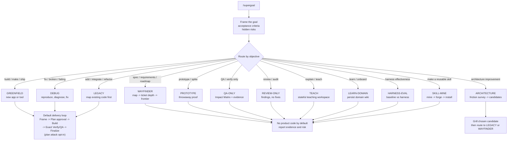

<p align="center"></p>

# /supergoal

**English** | [한국어](README.ko.md)

**One objective in, a verified result out. The smallest correct change, checked against the real tests.**
Nothing extra to install. Clone the repo, symlink it into your skills directory, then run
`/supergoal <objective>`.
Landing page: [cskwork.github.io/supergoal-skill](https://cskwork.github.io/supergoal-skill/).

An agent skill for heavy coding objectives where a normal "just edit it" pass is too easy to fool. It
takes one objective, chooses the right workflow route, uses fresh-context roles for code delivery, makes
the smallest correct change, checks the request and project docs against the real behavior, then stops.

## What `/supergoal` does

`/supergoal` is a routing and verification wrapper around an agent. The useful mental model:

1. **Route the objective.** The mode table classifies the real work kind, then routes as build,
   debug, legacy change, spec, wayfinding, prototype, QA, review, architecture, teaching, domain
   onboarding, harness eval, or skill mining.
   Broad new-app builds stay GREENFIELD but first get a `wayfinder/` Frontier Map so only one vertical slice enters delivery.
2. **Load only the needed playbook.** The root `SKILL.md` stays small; each route loads its own
   `reference/` and `agents/` files only when needed.
3. **Keep contexts fresh, keep dispatches few.** Code delivery runs five gates: Frame, Plan approval,
   Build, Exact Verify/QA, Finalize. Each iteration uses one fresh-context builder and one auditor.
   Browser and CLI work adds one evidence-only tester before the auditor. Frame discovers full-spec and
   edge-case coverage into the plan. The builder implements only the approved plan. The tester captures
   execution evidence. The auditor reruns the real tests and owns the verdict, the `GOAL.md` ticks, and
   `R-LOOP.md`. One optional extra dispatch exists: a trigger-gated pre-Build plan attack for risky or
   under-specified work.

   Workflow weight comes in three tiers. LIGHT handles narrow tasks with an explicit spec, running the
   same five gates with state held in context and no vault or role fan-out. STANDARD runs the full loop.
   DEEP adds the plan attack and an uncapped clarifying interview. Saying "quick" or "thorough"
   overrides the detection, and upgrades only go one way. Non-trivial runs spec out the request first:
   interview answers complete the `GOAL.md` spec, with Given/When/Then criteria, before `PLAN.md`
   exists. User-facing reports follow `reference/reporting.md`. Outcome first, Simplified Technical
   English, the project's own vocabulary.
4. **Run Before/After Eval.** Capture the before state, define the after target, write a completion
   promise, and keep a resumable run state plus command manifest so the final claim proves the delta
   instead of just saying "tests passed."
5. **Prove against the real project.** A green test run does not settle it. The run re-reads the whole
   spec and verifies against the repo's real tests, browser checks, DB evidence when that carries
   weight, and the prose spec. Hidden requirements the verifier finds become durable `GOAL.md` criteria,
   and the builder covers them red-first.
6. **Stop at the verified result.** No open-ended refactor, no proxy checklist, no fake green.

## What it adds over a plain baseline

A strong model reading the real spec is the bar. `/supergoal` adds the part a plain baseline skips
under pressure. A user-reviewed goal plan that already enumerates spec coverage and edge cases. A
builder that must exit green. An independent verifier that tries to disprove the result against the
project's own tests and docs, with the evidence recorded. Once invoked for code delivery, `/supergoal`
uses the role loop instead of downgrading to an inline shortcut.

Each role is a bundled file in `agents/`, so dispatch stays harness-agnostic across Claude Code, Codex,
agy, and other agent CLIs. Frame, Plan approval, Build, Exact Verify/QA, and Finalize are the mandatory
core. The conditional plan attack stays available when the requirements have not surfaced yet. The
conductor stays lean. Subagents load the heavy references for their own phase, and independent units
run in parallel.

## Principles

- **Verify against ground truth.** Re-run the project's REAL tests and re-read the request, ticket,
  README, design/API docs, and repo rules for checks the tests miss. Never generate a proxy
  checklist/verifier and optimize to it.
- **Smallest correct change.** Match the surrounding code; no whole-file rewrites to change a few lines.
- **Forced verification before trust.** After Build, compare the request/docs with the current behavior,
  even when visible tests are green; the plan attack is reserved for latent requirement risk.
- **Before/After Eval for real code changes.** GREENFIELD proves what was absent or red before. DEBUG
  reproduces the symptom. LEGACY and brownfield capture the behavior to preserve before changing it.
- **Ask only when genuinely ambiguous.** Resolve code-answerable questions by reading the code.
- **Hard stops.** A destructive or irreversible step needs consent. If the real tests cannot pass,
  report that. Never fake a pass.
- **Standing rules (read first).** If the target project has `.supergoal/rules/RULES.md`, supergoal reads
  it before every run and honors it across all modes as the highest-priority preferences. It never
  weakens a safety gate. The file is created only when you ask, is gitignored, and is otherwise left
  untouched (`reference/rules.md`).

## Modes

`/supergoal` detects the mode from your objective:


```mermaid
flowchart TD
    A["/supergoal <one heavy objective>"] --> B["Frame the goal<br/>acceptance criteria<br/>hidden risks"]
    B --> C{"Route by objective"}

    C -->|"build / make / ship"| GREENFIELD["GREENFIELD<br/>new app or tool"]
    C -->|"fix / broken / failing"| DEBUG["DEBUG<br/>reproduce, diagnose, fix"]
    C -->|"add / integrate / refactor"| LEGACY["LEGACY<br/>map existing code first"]
    C -->|"spec / requirements / roadmap"| WAYFINDER["WAYFINDER<br/>map -> ticket depth -> frontier"]
    C -->|"prototype / spike"| PROTOTYPE["PROTOTYPE<br/>throwaway proof"]
    C -->|"QA / verify only"| QAONLY["QA-ONLY<br/>Impact Matrix + evidence"]
    C -->|"review / audit"| REVIEW["REVIEW-ONLY<br/>findings, no fixes"]
    C -->|"architecture improvement"| ARCHITECTURE["ARCHITECTURE<br/>friction survey -> candidates"]
    C -->|"explain / teach"| TEACH["TEACH<br/>stateful teaching workspace"]
    C -->|"learn / onboard"| LEARN["LEARN-DOMAIN<br/>persist domain wiki"]
    C -->|"harness effectiveness"| HARNESS["HARNESS-EVAL<br/>baseline vs harness"]
    C -->|"make a reusable skill"| SKILLMINE["SKILL-MINE<br/>mine -> forge -> install"]

    GREENFIELD --> LOOP["Default delivery loop<br/>Frame -> Plan approval -> Build<br/>-> Exact Verify/QA -> Finalize<br/>(plan attack opt-in)"]
    DEBUG --> LOOP
    LEGACY --> LOOP

    WAYFINDER --> REPORT
    PROTOTYPE --> REPORT
    ARCHITECTURE --> PICK["Grill chosen candidate<br/>then route to LEGACY or WAYFINDER"]

    QAONLY --> REPORT["No product code by default<br/>report evidence and risk"]
    REVIEW --> REPORT
    TEACH --> REPORT
    LEARN --> REPORT
    HARNESS --> REPORT
    SKILLMINE --> REPORT
```

| Objective looks like | Mode | Approach |
|---|---|---|
| "build / ship a new app/tool" | **GREENFIELD** | default loop; broad/foggy app requests first use a `wayfinder/` Frontier Map, then one selected vertical slice enters Build |
| "fix / broken / failing / why does" | **DEBUG** | default loop; reproduce with a failing test first |
| "add X to our existing/legacy code" | **LEGACY** | default loop; map the code first; refactoring an existing API: capture its exact behavior first, Verify diffs against that baseline |
| "spec this / break this into tickets / roadmap / what first?" | **WAYFINDER** | issue map under the run vault's `wayfinder/` folder -> optional ticket-depth sections (glossary, user story, EARS checks, design notes, tasks) and cited research assets via `reference/research.md` when outside facts are needed -> vertical tickets -> blocker edges -> next frontier; route one ticket, stop, then ask for context clear + integration test before the next |
| "prototype / spike / try variants before building" | **PROTOTYPE** | throwaway proof answers one question; UI/interaction prototypes load SuperDesign for design and render gates; then delete/quarantine or route the decision into delivery |
| "explain / teach me X" (no code) | **TEACH** | Mission -> Source -> Bridge -> Teach (Archify when relationships matter) -> Check (explain-back) |
| "learn / map / onboard onto this codebase" | **LEARN-DOMAIN** | Survey -> Map -> Ground -> Persist a `.domain-agent/` wiki |
| "QA only / verify / compare data - no code" | **QA-ONLY** | Detailed Impact Matrix (feature-impact QA map) + read-only DB -> evidence -> `report.md` |
| "review / audit this code/diff/PR - no fixes" | **REVIEW-ONLY** | Two independent reviewers -> verified findings -> `report.md` |
| "improve the architecture / find refactoring opportunities" or "draw / diagram / 그려" (arch, flow, sequence, state) | **ARCHITECTURE** | Draw-only ask: render a self-contained HTML diagram via archify and stop. Else friction survey -> candidates as a visual `report.html` -> grill the pick -> refactor routes to LEGACY/WAYFINDER |
| "test harness effectiveness / with vs without" | **HARNESS-EVAL** | Cases -> baseline run -> harness run -> machine checks -> quality score -> compare |
| "make a skill from history - no product code" | **SKILL-MINE** | Mine history -> rank -> you pick -> forge portable `SKILL.md` -> install |

**Default loop (GREENFIELD / DEBUG / LEGACY):**

1. **Frame** the goal: write `GOAL.md` first (the user's request verbatim + refined spec + falsifiable
   Success Criteria checkboxes + browser QA cases for web apps), freeze a self-sufficient `PLAN.md`
   (steps, tools & skills, verification strategy), start `QA.md` `## Before` plus `run-state.json`.
   The Success Criteria already enumerate full-spec coverage and edge-case/resilience checks, so the
   user reviews them at the next gate. For broad GREENFIELD requests, Frame first writes an internal
   `wayfinder/map.md`, creates vertical tickets under `wayfinder/tickets/`, selects the first unblocked
   frontier, and copies only that ticket's acceptance checks into delivery. The route remains
   GREENFIELD; WAYFINDER stays the explicit no-code planning mode.
2. **Plan approval.** The user reviews the goal plan. An interactive session needs the user's explicit
   OK; an autonomous run auto-approves and records that. Build never starts before this gate.
3. **Build** the smallest correct change in one fresh-context implementer briefed by `PLAN.md` alone,
   test-first, so a bug gets a failing test first. The builder covers every planned criterion in the
   plan's `## Acceptance checklist`, including the edge-case and resilience criteria discovered at
   Frame, and exits only on a green suite.
4. **Exact Verify/QA** with a fresh-context auditor in an adversarial stance. Browser/CLI work first
   dispatches an evidence-only tester for real scenarios and captures, then the auditor consumes that
   evidence, reruns the real non-browser tests, diffs the change against `GOAL.md`, ticks proven
   criteria, and owns the final verdict. Non-browser work goes directly to the auditor. Unmet criteria
   go to a timestamped `R-LOOP.md` section and the implementer relaunches. That loop-back is the only
   fix channel.
5. **Finalize.** Stop only after every `GOAL.md` box is checked and the `Z-<date>.md` completion marker
   (run branch plus timestamp) is written with the command output recorded. Then pass the commit gate
   and merge after user acceptance. The Build to Verify loop caps at 3 iterations by default, forces a
   reflection, then escalates to the user.

Coding and debug runs use a run worktree by default. Resolve and verify the source/base branch and the
target/integration branch before editing, create the run worktree from source/base, and commit or merge
into the verified target/integration branch only after green verification and user acceptance. Browser
UI changes also require real browser QA: `Tool: agent-browser` evidence and
`qa-gate.sh <vault> browser`.

```text
/supergoal build a habit-tracker app and ship it
/supergoal the checkout page hangs intermittently in prod. fix it
/supergoal add SSO to our legacy Django monolith
/supergoal break this billing migration into tickets with blockers and tell me what to do first
/supergoal prototype three checkout flows before we commit to the implementation
/supergoal learn this codebase and build a domain wiki
/supergoal QA the checkout flow on staging and check the order totals match the DB (no code change)
/supergoal compare this migration harness with and without the harness on 3 cases
```

WAYFINDER, PROTOTYPE, QA-ONLY, REVIEW-ONLY, ARCHITECTURE, TEACH/LEARN-DOMAIN, HARNESS-EVAL, and
SKILL-MINE each serve a separate purpose: ticket maps, throwaway proofs, detailed no-code QA,
findings-only review, teaching and onboarding, harness measurement, and skill forging. QA-ONLY is the
broad regression lane. Its Impact Matrix maps everything the feature can affect: displayed data
consistency, direct behavior, adjacent screens, complex multi-step scenarios, before/during/after
actions, and the risk left uncovered inside the action cap. Independent QA areas can run as scenario
shards, and the conductor merges them through `qa/scenario-ledger.md`.
These modes write no product code by default. PROTOTYPE writes only isolated throwaway code and has to
route back through delivery before anything ships. UI and interaction prototypes load SuperDesign;
logic/state and data/API prototypes keep their lightweight, non-visual paths.

## Board (optional live dashboard)

Watch progress across concurrent agents in real time. `bash tui/launch.sh &` opens a Textual dashboard
in the browser. It shows each agent's mode and workflow stage, from Frame through Plan approval, Build,
Exact Verify/QA, and Finalize, with the plan attack appearing only when escalated. A Jira-like task
board groups the agents by repo, branch, and worktree. Branch is advisory and never locked, so several
agents can share a branch freely.

The Board only observes. It is opt-in, best-effort, and it never gates or blocks a run. If no agent
emits, every mode still passes unchanged. When enabled, the conductor calls `sg-emit`
(`templates/observability/`) at each phase transition, writing one atomically-replaced heartbeat JSON
per agent under `~/.supergoal/runs/agents/`. The dashboard in `tui/` polls and renders them.
Correctness needs only one writer per file plus an atomic rename, so there is no lock anywhere.
In-browser serving needs `pip install textual-serve`; without it, run the local TUI with
`python -m tui.app`. Full spec: [`reference/observability.md`](reference/observability.md).

## Install

This repo **is** the skill. Put it where your agent CLI finds skills:

```bash
git clone https://github.com/cskwork/supergoal-skill.git
cd supergoal-skill
SRC="$(pwd)"
mkdir -p ~/.agents/skills ~/.codex/skills ~/.claude/skills

# Recommended: one canonical source checkout, symlinked into each active agent.
# If a target already exists, audit it first and preserve any local edits before replacing it.
ln -s "$SRC" ~/.agents/skills/supergoal
ln -s "$SRC" ~/.codex/skills/supergoal
ln -s "$SRC" ~/.claude/skills/supergoal

# Read-only drift check for active installs:
node templates/skill-install-audit.mjs "$SRC"

# Canonical repo verification:
bash tests/run-all.sh
```

Then in your agent CLI: `/supergoal <your objective>`.

### Windows

The skill runs on Windows. The remaining gate and test scripts are POSIX shell, so run them under Git
Bash or WSL, with `node` on `PATH`. The repo pins `.gitattributes eol=lf`. If symlinks need admin
rights, install by copy instead: `cp -R` in Git Bash or WSL, or `mklink /D` from an elevated `cmd`.
After copying, run `node templates/skill-install-audit.mjs <source-skill-dir>`, then run the contract
tests under WSL bash.

## Layout

```
SKILL.md            thin spine: baseline-first loop, modes, reference map
agents/             one persona file per role (analyst, architect, executor, debugger, explore, designer, qa-*, db-reader, code-reviewer, security-reviewer)
reference/          domain-rules · rules (project standing rules) · domain-context · debugging · interview · reporting · delivery-gate · plan-grounding · research · market-research · qa · qa-only · db-access · teach · learn-domain · ui-ux · taste-skill-v2 · functional-ui · harness-eval · skill-mine · observability
teach/              TEACH-mode format guides + per-topic teaching workspaces
templates/          GOAL.md · PLAN.md · QA.md · R-LOOP.md · Z-DONE.md · run-state.json · rules.md · qa-gate.sh · qa-only-gate.sh · commit-gate.sh · contrast-gate.mjs · learn-grounding-gate.mjs · qa-report.md · db-access/ · domain-agent/ · domain-onboarding.html · arch-report.html · harness-eval-gate.mjs · harness-eval-stats.mjs · harness-eval-cases/ · skill-mine/ · skill-frontmatter-gate.mjs · skill-install-audit.mjs · skill.md.template · observability/ (sg-emit board state)
tests/              contract tests + run-all.sh canonical verifier
tui/                optional live Board: state.py (reader) · app.py (Textual UI) · serve.py (in-browser) · launch.sh
docs/               DESIGN.md · research-brief.md · experiments/ (the harness evals) · changelog/ · index.html (landing)
examples/           optional worked services when vendored; run-all skips them when absent
```

## Evidence

The design comes out of head-to-head evals, especially
`docs/experiments/2026-07-01-roleloop-coverage-fix-claude-ab/FINDINGS.md` and
`docs/harness-eval-explained.md`. One result shapes the current skill. On tasks with an explicit spec,
the request/docs verification pass beat the one-shot baseline, and it matched or beat role separation
at lower ceremony. Generated-proxy verifiers can score worse, because the run optimizes to the proxy.
The next thing to prove is not more synthetic fixtures. It is the production-adoption plan in
`docs/changelog/2026-07/02-production-adoption/plan.md`, which tracks symlink deployment, trigger
accuracy, and production pilot metrics: date, mode, gaps, and gate results. Older worked examples may
be vendored under `examples/`; the canonical verifier skips that optional step when they are absent.

## Harness eval reference

HARNESS-EVAL reusable sample cases come from RevFactory's `claude-code-harness`:
https://github.com/revfactory/claude-code-harness/

Current HARNESS-EVAL claims use four axes: task correctness, token/cost, wall-clock speed, and routing
accuracy. Binary pass/fail comparisons use paired McNemar with SNR filtering; gradient quality scores
keep the existing sign-flip/BCa gate.

## Credit

Concept and workflow adapted from oh-my-symphony by cskwork
(https://github.com/cskwork/oh-my-symphony). WAYFINDER and the research-depth ideas also credit
Matt Pocock's public skills, especially the research and skill-writing patterns. UI and interaction
prototypes route through cskwork's superdesign-skill
(https://github.com/cskwork/superdesign-skill).

## License

MIT. See [`LICENSE`](LICENSE).
